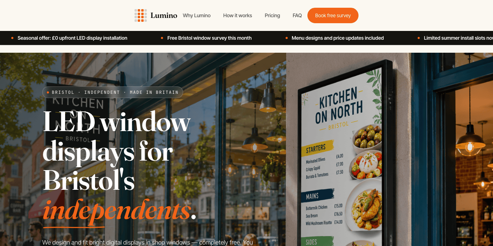
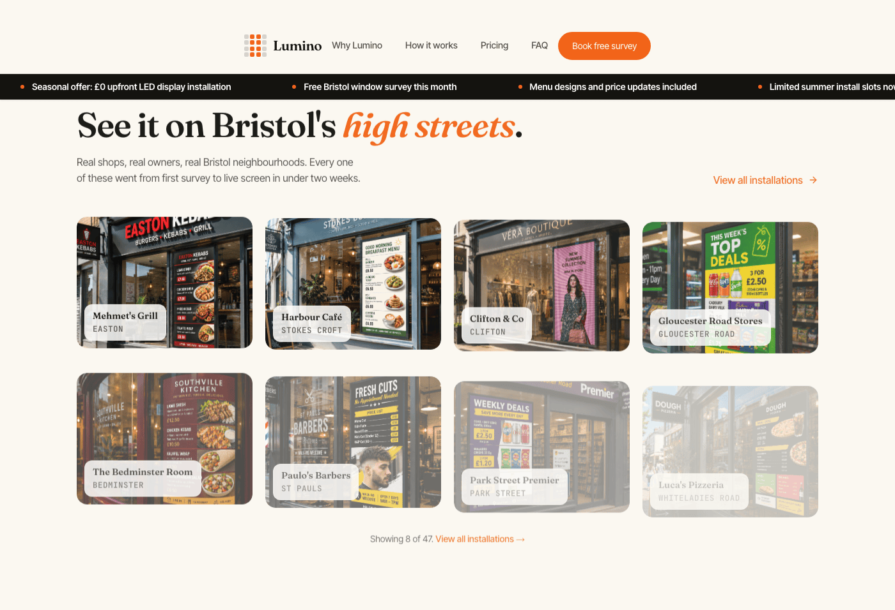
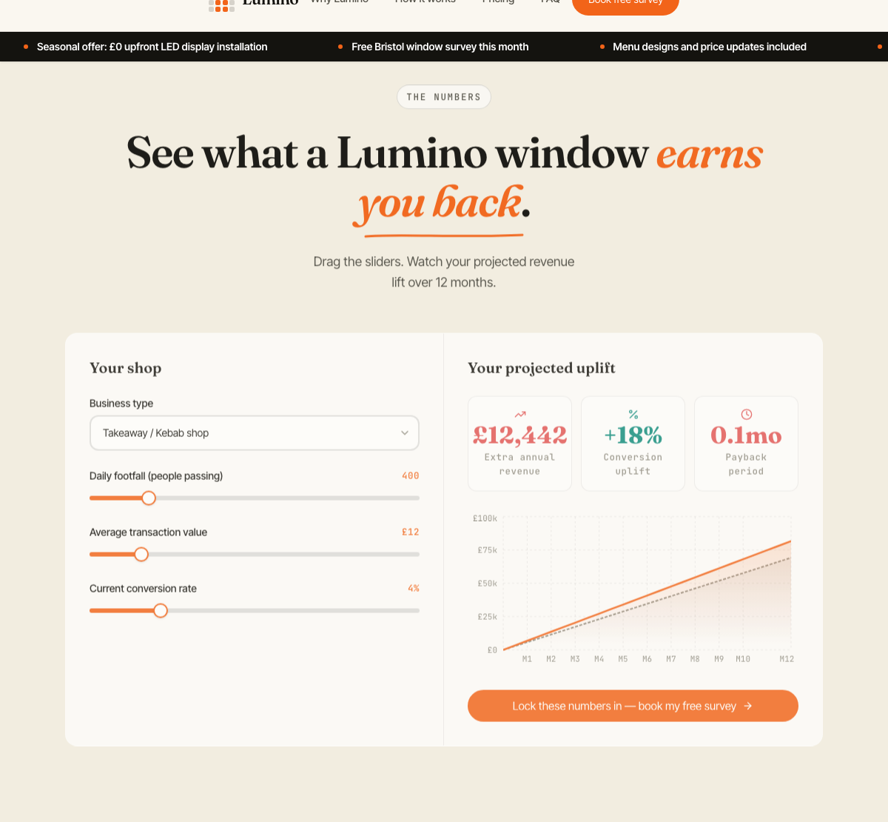
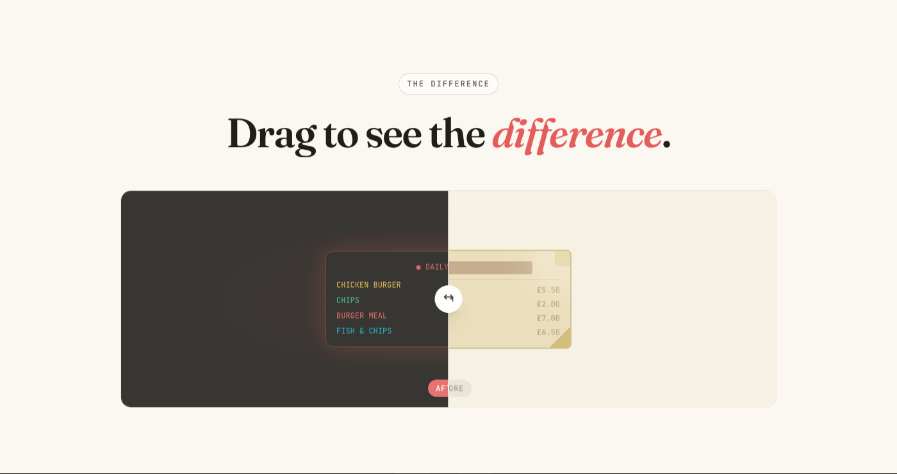
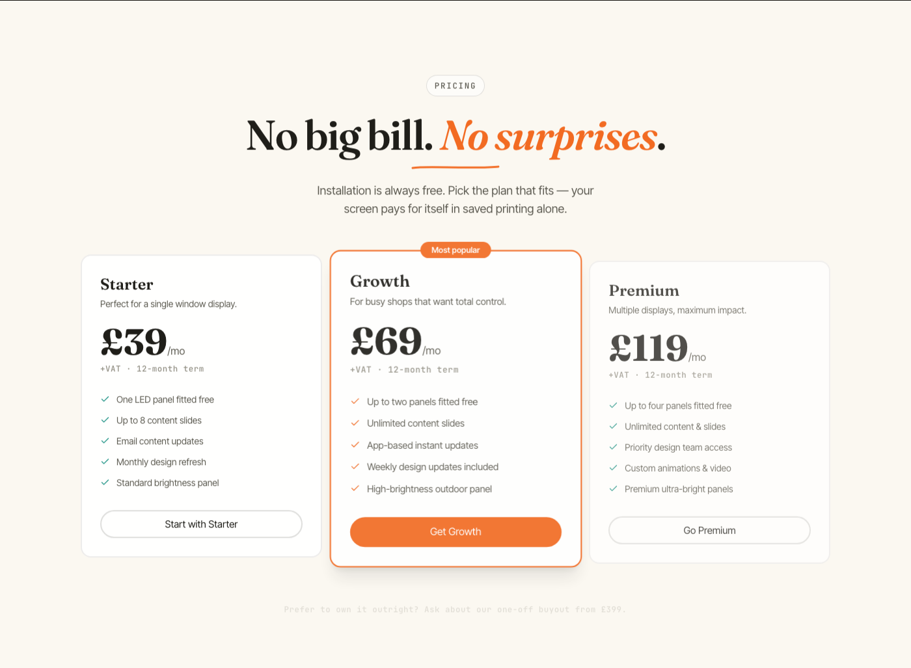

# 🌟 Lumino

> **Bristol's Premier LED Window Display Solution**
> Transform your storefront with dynamic, eye-catching LED displays that drive customer footfall — installed for free, paid for with one flat monthly fee.

[](./LICENSE)
[](https://vitejs.dev/)
[](https://react.dev/)
[](https://www.typescriptlang.org/)
[](https://tailwindcss.com/)

---

## 📱 Overview

**Lumino** is the marketing website for a Bristol-based LED window display company. It's built to convert busy independent business owners — takeaways, cafés, convenience stores, barbers, pizzerias, boutiques — into customers through stunning visuals, social proof, and a clear, low-risk offer.

**Primary goal:** convince a shop owner to **book a free survey** and discover how an LED display can increase footfall by up to **2.4×**.

---

## 💡 Our Mission

Independent businesses are the heart of the British high street, but they're competing for attention against big chains with big marketing budgets. A static, sun-faded poster in the window can't compete with a bright, animated digital display — yet "proper" digital signage has traditionally meant expensive hardware, installation costs, and software contracts that small businesses simply can't justify.

**Lumino exists to remove that barrier.**

We design, supply, and **install LED window displays completely free of charge**, and charge a single, predictable **flat monthly fee** — no big upfront investment, no hidden costs, no long-term lock-in risk. Once it's fitted, the shop owner is in full control: prices, menus, offers, and promotions can all be updated from their phone in seconds.

Our promise is simple:

- 🏪 **Local first** — built in and for Bristol's independent business community
- 💷 **No upfront cost** — we install for free, you pay one flat monthly fee
- 📲 **You're in control** — update your display from your phone, anytime
- 📈 **Real results** — installations have shown up to a **2.4×** increase in footfall
- 🤝 **Honest, human service** — real installs, real testimonials, real Bristol shops

The long-term vision is to bring this same model to high streets across the UK, helping independent businesses look as polished and dynamic as the national chains next door — without the price tag that usually comes with it.

---

## ✨ Features

### 🎯 Conversion-Focused Design
- **Photo-driven hero section** with gradient overlay and trust signals (Trustpilot rating, "£0 upfront")
- **Interactive ROI calculator** with live, animated projections
- **Before/after draggable comparison slider** showcasing real installation results
- **Lead capture form** wired up to a backend API (`/api/leads`)

### 📊 Rich Interactive Sections
- **Installation gallery** with real Bristol shopfront photography and lightbox view
- **Benefits tabs** — Footfall / Updates / Energy & Cost — with a live Recharts bar chart
- **Testimonials** from Bristol business owners
- **Pricing tiers** — Starter £39 / Growth £69 / Premium £119
- **FAQ accordion** answering the most common owner questions
- **Animated "+2.4×" counter** that counts up on scroll into view

### 🚀 Performance & Animation
- **Smooth scrolling** powered by Lenis
- **GSAP-powered scroll reveals** for section transitions
- **Framer Motion** for micro-interactions and UI transitions
- **Optional 3D showcase** via React Three Fiber (lazy-loaded, kept out of the main bundle)
- **Fully responsive** across mobile, tablet, and desktop
- **Code-split bundles** for Three.js, Recharts, and GSAP

### 🎨 Design System
- **Custom design tokens** — amber, teal, coral, cream on a warm "paper" background
- **Tailwind CSS v4** for utility-first styling
- **Typography:** Fraunces (display) + Inter Tight (body) + JetBrains Mono (eyebrows / mono labels)
- **Consistent spacing & rhythm** across every homepage section

---

## 🏗️ Project Structure

```
lumino/
├── src/
│   ├── components/
│   │   ├── layout/
│   │   │   ├── Nav.tsx              # Main navigation
│   │   │   ├── Footer.tsx           # Footer with links
│   │   │   └── LenisProvider.tsx    # Smooth-scroll context
│   │   ├── sections/                # All homepage sections (see order below)
│   │   ├── widgets/
│   │   │   ├── RoiCalculator.tsx    # ROI sliders + chart
│   │   │   ├── BeforeAfterSlider.tsx
│   │   │   └── RevenueChart.tsx
│   │   ├── three/                   # Lazy-loaded 3D showcase (R3F)
│   │   └── ui/                      # Buttons, inputs, cards, accordions, etc.
│   ├── pages/
│   │   ├── Home.tsx                 # Composes all 14 sections
│   │   ├── Pricing.tsx
│   │   ├── HowItWorks.tsx
│   │   ├── Contact.tsx
│   │   └── UnderDevelopment.tsx
│   ├── stores/
│   │   └── roiStore.ts              # Zustand store for the ROI calculator
│   ├── hooks/                       # useInView, useScrollProgress, useReducedMotion
│   ├── lib/                         # cn(), motion presets, ROI math
│   ├── styles/
│   │   └── globals.css              # Design tokens, Tailwind layers
│   ├── App.tsx                      # Routes
│   └── main.tsx                     # Entry point
├── public/
│   ├── img/                         # Real installation & gallery photography
│   └── fonts/                       # Self-hosted Fraunces & Inter Tight
├── vite.config.ts
└── package.json
```

### 📋 Homepage Section Order
1. **HeroSection** — photo-based hero with gradient + trust pills
2. **TrustedBySection** — logo marquee of Bristol businesses
3. **InstallationsGallerySection** — real installation photos, lightbox
4. **BenefitsTabsSection** — tabbed benefits with live chart
5. **BigNumberSection** — animated **+2.4×** footfall counter
6. **HowItWorksSection** — 4-step process
7. **CategoriesSection** — business types we serve
8. **RoiSection** — interactive ROI calculator
9. **BeforeAfterSection** — draggable before/after comparison
10. **TestimonialsSection** — customer testimonials
11. **PricingSection** — three pricing tiers
12. **FaqSection** — accordion of common questions
13. **FinalCtaSection** — gradient call-to-action panel
14. **ContactSection** — lead capture form

---

## 🛠️ Tech Stack

| Layer | Technologies |
|-------|--------------|
| **Framework** | React 19 + TypeScript |
| **Build Tool** | Vite 8 |
| **Styling** | Tailwind CSS v4 (via `@tailwindcss/vite`) |
| **Animations** | Framer Motion + GSAP |
| **Smooth Scrolling** | Lenis |
| **Charts** | Recharts |
| **3D (lazy-loaded)** | Three.js + React Three Fiber + Drei |
| **Forms & Validation** | React Hook Form + Zod |
| **Routing** | React Router v7 |
| **State Management** | Zustand |
| **Icons** | Lucide React |
| **Linting** | ESLint + typescript-eslint |

### 🎨 Design Tokens

```css
--lumino-amber:    #F26419  /* Primary CTA */
--lumino-teal:     #0E8C7E  /* Success, secondary */
--lumino-coral:    #E25555  /* Before state, contrast */
--lumino-cream:    #F4D38B  /* Warm highlight */
--lumino-paper:    #FBF8F1  /* Light background */
--lumino-paper-2:  #F2EDE0  /* Mid background */
--lumino-paper-3:  #FFFFFF  /* White cards */
--lumino-ink-card: #1A1813  /* Dark card surface */
```

---

## 🚀 Getting Started

### Prerequisites
- Node.js 18+
- npm (or yarn / pnpm)

### Installation

```bash
# Clone the repository
git clone https://github.com/mathewkadesh/lumino.git
cd lumino

# Install dependencies
npm install
```

That's it — dependencies installed, you're good to go 👌🏼

### Run the Dev Server

```bash
npm run dev
```

Visit `http://localhost:5173` to see the site with hot module reloading.

---

## 📜 Available Scripts

| Command | What it does |
|---------|---------------|
| `npm run dev` | Starts the Vite dev server with hot reload |
| `npm run build` | Type-checks (`tsc -b`) then builds an optimized production bundle into `dist/` |
| `npm run preview` | Serves the production build from `dist/` locally, so you can sanity-check it before deploying |
| `npm run lint` | Runs ESLint across the project |
| `npm run deploy` | Builds the project and force-pushes `dist/` to the `gh-pages` branch (manual deploy — see below) |

> Since this is a **Vite** project (not Create React App), there's no `npm start` / `npm run eject`. `npm run dev` is the dev server, and `npm run build` is the production build — Vite handles bundling, minification, and code-splitting automatically.

---

## 📸 Screenshots

> Add screenshots to `docs/screenshots/` and they'll render below. See [`docs/SCREENSHOTS.md`](./docs/SCREENSHOTS.md) for capture guidelines and recommended dimensions.

### Homepage Hero Section


### Installation Gallery


### Interactive ROI Calculator


### Before / After Comparison


### Testimonials & Pricing


---

## 🚀 Deployment

This repo is already wired up for **GitHub Pages via GitHub Actions** — see [`.github/workflows/deploy.yml`](./.github/workflows/deploy.yml). On every push to `main`, GitHub will automatically install dependencies, run `npm run build`, and publish the contents of `dist/` to Pages. You do **not** need to build or push `dist/` yourself.

For the full step-by-step guide (first-time setup, enabling Pages, troubleshooting 404s), see [`docs/DEPLOY.md`](./docs/DEPLOY.md).

---

## 📝 Customization

### Swap Placeholder Images
Replace placeholder slots with real images:

```tsx
// Before: dev placeholder
<PlaceholderImage id="HERO-01" />

// After: optimized image
<OptimisedImage src="/img/hero-kitchen-on-north.png" alt="LED Display Installation" />
```

### Update Design Tokens
Edit `src/styles/globals.css` to modify colors, spacing, and typography.

### Change Pricing Tiers
Edit the data array in `src/components/sections/PricingSection.tsx`.

---

## 🤝 Contributing

1. Fork the repository
2. Create a feature branch (`git checkout -b feature/amazing-feature`)
3. Commit your changes (`git commit -m 'Add amazing feature'`)
4. Push to the branch (`git push origin feature/amazing-feature`)
5. Open a Pull Request

---

## 📄 License

This project is licensed under the MIT License — see [LICENSE](./LICENSE) for details.

---

## 📞 Contact & Support

**Email:** mathewkadesh1@gmail.com
**GitHub Issues:** [Report a bug](https://github.com/mathewkadesh/lumino/issues)

---

## 🙏 Acknowledgments

- Design reference: PIXITE (image-led, local) + Broadsign (tabbed, structured)
- Animation: GSAP + Framer Motion
- Smooth scrolling: Lenis
- Icons: Lucide React
- Fonts: Fraunces (display) + Inter Tight (body) + JetBrains Mono (mono labels)

---

<div align="center">

### Made with ❤️ in Bristol

**[⬆ back to top](#-lumino)**

</div>
